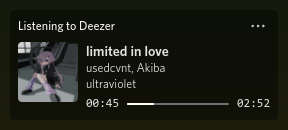

    <h1>Deezer Discord RPC</h1>
    
    
    
    
    

    
A Discord RPC for showing the music you're listening to on Deezer (like the Spotify integration).

    <a href="https://github.com/JustYuuto/deezer-discord-rpc/wiki/Troubleshooting">Check the troubleshooting page if you have issues</a>

## Features

* Updates instantly
* Shows the song title, the song artist(s), the album name and cover, and the song duration
* Shows a "Listen on Deezer" button that opens the song on Deezer, if supported
* An in-app updater
* Hides the activity if no song is playing
* Sets a "Listening to" status on the profile
* Includes an ad-blocker, so it can block Deezer ads, Sentry requests...
* Supports songs, radios, personal songs (MP3s), podcasts

## Screenshots

#### RPC on profile:

#### Tray menu:

## Star History

## License

This project is licensed under the MIT License - see the [LICENSE](LICENSE) file for details.
