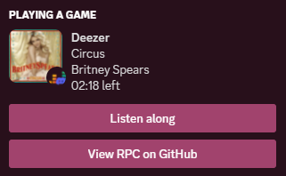
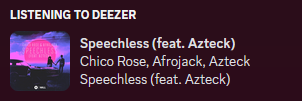
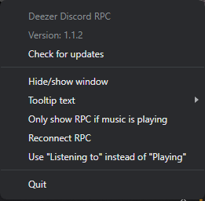

    <h1>Deezer Discord RPC</h1>
    
    
    
    
    

    
A Discord RPC for showing the music you're listening to on Deezer (like Spotify integration).

    
If you want to use it on your phone, the app is available on Android: <a href="https://github.com/JustYuuto/deezer-discord-rpc-android/releases/latest">latest release</a>

## Features

* Updates instantly
* Shows the song title, the song artist(s), the album cover (when the mouse is over the album cover the album title is shown) and the song duration
* On the RPC there's a "Listen along" button like on the Spotify integration. This is a link to the song
* An in-app updater
* Can hide the activity if song is not playing
* Can set a "Listening to" status (like Spotify) (**requires your Discord token**)
* Includes an ad-blocker, so it can block Deezer ads, Sentry requests...
* Supports songs, radios, personal songs, podcasts

## Screenshots

#### RPC on profile:

With the "Playing" status:

With the "Listening to" status:

#### Tray menu:

## Todo

* [x] Implement Discord WebSocket server to get a "Listening to" status on the profile
* [x] Support podcasts

## License

Mozilla Public License 2.0
